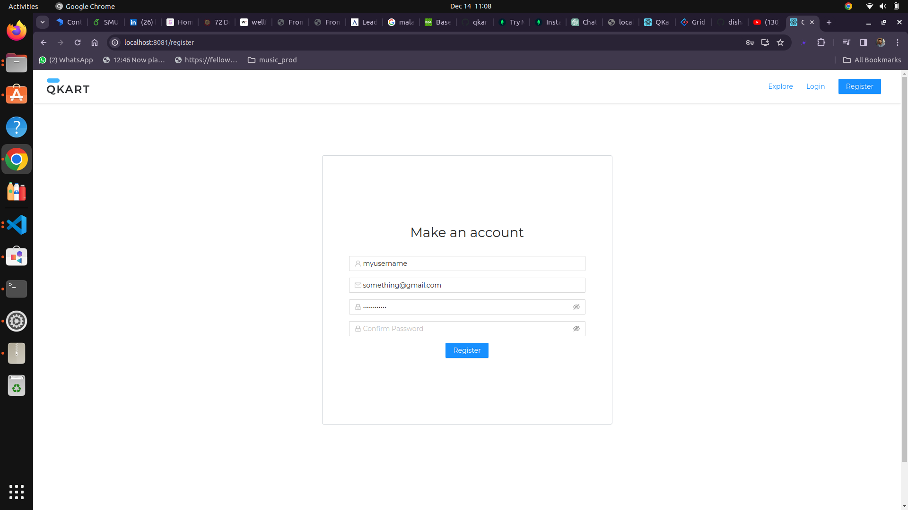

# Qkart

## An E-commerce website (screen shots included below)

Ecommerce website built on MERN stack.

## Screenshots




## Installation

### Backend

1. **MongoDB Setup:**
   - Ensure MongoDB is installed on your machine.
   - Start your MongoDB server.

2. **Backend Configuration:**
   - Navigate to the `backend` folder.
   - Run `npm install` to install dependencies.
   - Update the MongoDB connection URL in the `.env` file.

     ```plaintext
     MONGODB_URL=mongodb://localhost:27017/your-database-name
     ```
   
3. **Run Backend Service:**
   - Execute `npm run start` to start the backend service.

### Frontend

1. **Frontend Configuration:**
   - Navigate to the `frontend` folder.
   - Run `npm install` to install dependencies.
   - Update the backend URL in the configuration.

     ```plaintext
     // Update the backend URL in a configuration file (e.g., src/config.js)
     const backendUrl = 'http://localhost:3000'; // Update with your local or hosted backend URL
     ```

2. **Run Frontend:**
   - Execute `npm run start` to start the frontend application.

3. **Access the Application:**
   - Open your web browser and navigate to the specified URL (e.g., `http://localhost:your-frontend-port`).
  
